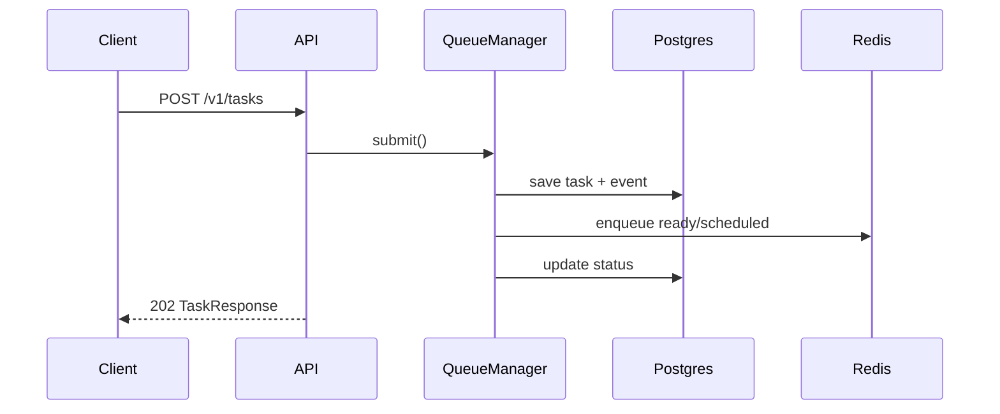
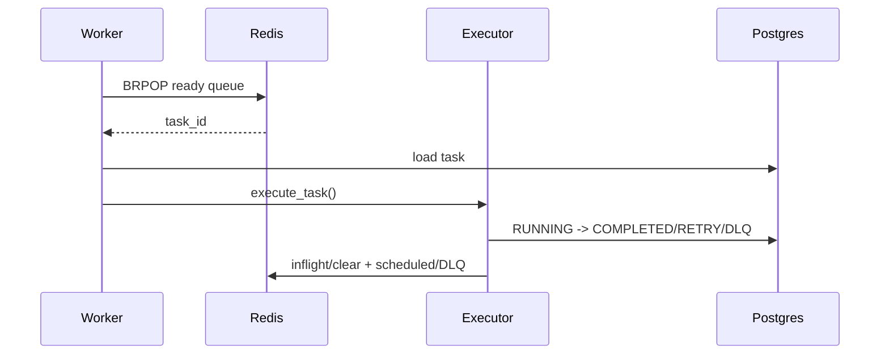
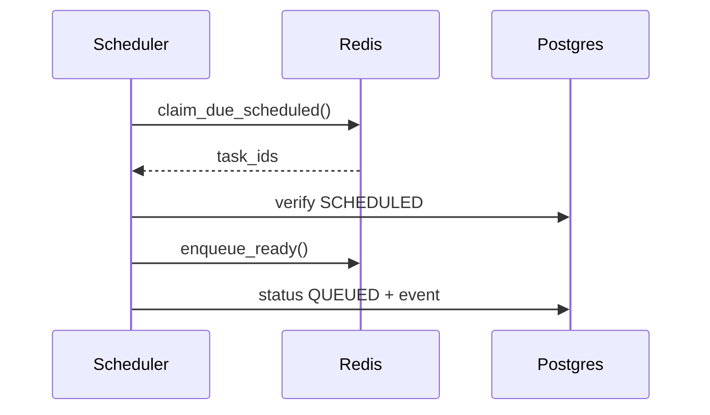

# Sequence Diagrams

## Task submit

```mermaid
sequenceDiagram
    participant Client
    participant API
    participant QueueManager
    participant Postgres
    participant Redis

    Client->>API: POST /v1/tasks
    API->>QueueManager: submit()
    QueueManager->>Postgres: save task + event
    QueueManager->>Redis: enqueue ready/scheduled
    QueueManager->>Postgres: update status
    API-->>Client: 202 TaskResponse
```

## Worker execution

```mermaid
sequenceDiagram
    participant Worker
    participant Redis
    participant Executor
    participant Postgres

    Worker->>Redis: BRPOP ready queue
    Redis-->>Worker: task_id
    Worker->>Postgres: load task
    Worker->>Executor: execute_task()
    Executor->>Postgres: RUNNING -> COMPLETED/RETRY/DLQ
    Executor->>Redis: inflight/clear + scheduled/DLQ
```

## Scheduler release

```mermaid
sequenceDiagram
    participant Scheduler
    participant Redis
    participant Postgres

    Scheduler->>Redis: claim_due_scheduled()
    Redis-->>Scheduler: task_ids
    Scheduler->>Postgres: verify SCHEDULED
    Scheduler->>Redis: enqueue_ready()
    Scheduler->>Postgres: status QUEUED + event
```
